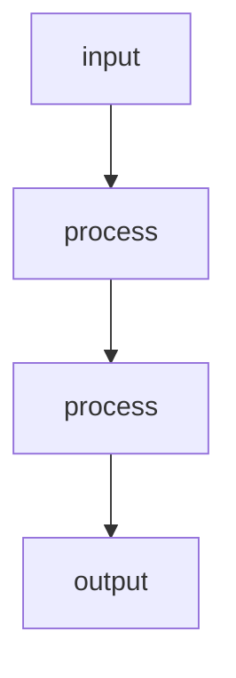
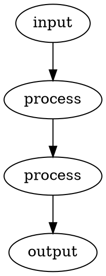

# GraphKit Mermaid Example

## Graph: Mermaid Export Example

```mermaid
graph TD
  source[input]
  process1[process]
  process2[process]
  final[output]
  source --> process1
  process1 --> process2
  process2 --> final

```

## DOT Format

```dot
digraph G {
  "source" [label="input"];
  "process1" [label="process"];
  "process2" [label="process"];
  "final" [label="output"];
  "source" -> "process1";
  "process1" -> "process2";
  "process2" -> "final";
}
```
