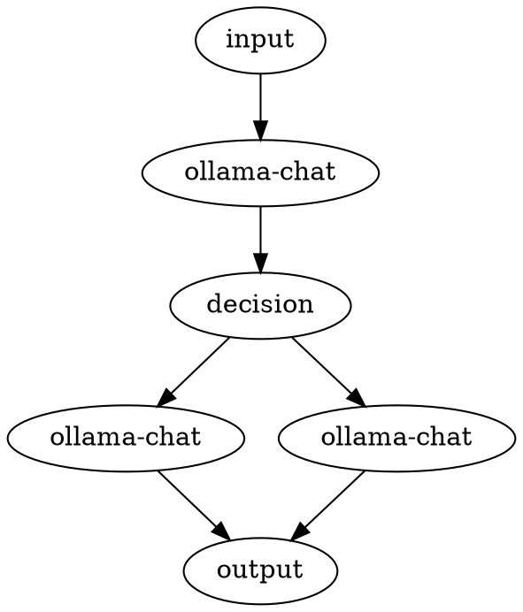

# AI Workflow - RAG Pipeline

This is a visualization of an AI workflow that:
1. Takes a user query
2. Rewrites it for better search
3. Routes to specialized agents (technical vs general)
4. Combines results

## Mermaid Diagram

```mermaid
graph TD
  start[input]
  rewrite-query[ollama-chat]
  router[decision]
  tech-agent[ollama-chat]
  general-agent[ollama-chat]
  end[output]
  start --> rewrite-query
  rewrite-query --> router
  router --> tech-agent
  router --> general-agent
  tech-agent --> end
  general-agent --> end

```

## DOT Diagram


